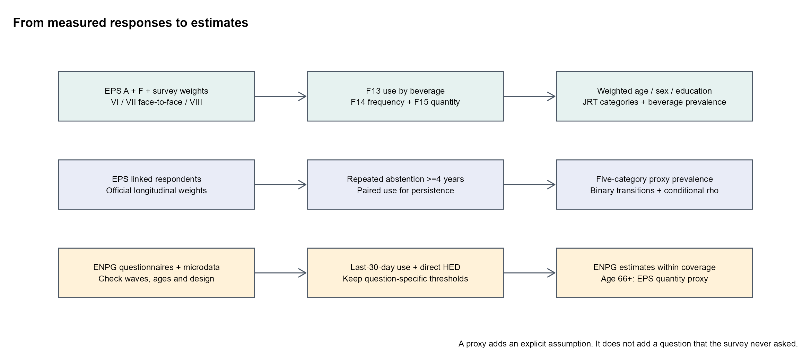
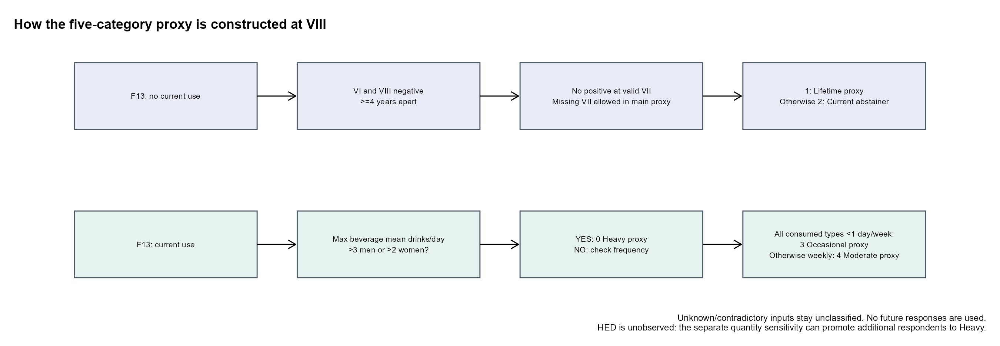

# EPS: qué podemos estimar y qué cambia entre rondas

**Abre el [HTML en inglés](eps_alcohol_prevalencia_persistencia.html) o el [notebook R](eps_alcohol_prevalencia_persistencia.ipynb) después de leer este informe en español.** Lectura aproximada: 8 minutos. Fecha: 21 de septiembre de 2026.

**Resultado principal:** EPS permite estimar consumo por cerveza, vino y destilados, extender edades y construir las cinco categorías mediante una **aproximación longitudinal de Calvo**. ENPG aporta HED preguntado directamente, pero sus bases locales no cubren 66 años o más. El notebook conserva por separado las definiciones JRT y estima persistencia; el informe explica qué representa cada resultado.

**Cómo leer el mapa:** la primera ruta estima prevalencias EPS; la segunda usa historia longitudinal para el proxy de abstinencia y rho; la tercera estima consumo/HED en ENPG dentro de las edades efectivamente observadas.

## 1. Qué revisé

Inventarié **115 archivos Stata de EPS**, leí sus etiquetas/códigos y contrasté módulos, cuestionarios, manuales y factores de expansión. Revisé los dos artículos de Calvo, el suplemento de 2020, el código JRT, las celdas activas de `expand_pif*` y las nueve ondas locales de ENPG, 2008–2024. El nombre oficial de EPS es **Encuesta de Protección Social**, un panel de personas con muestras de refresco; los registros de familiares no son entrevistados adicionales del panel.

El notebook conserva el orden del precedente: configuración, procedencia, armonización, diseño, estimaciones, diagnósticos, figuras, exportación y sesión. Está escrito en R, con explicaciones y comentarios en inglés, funciones incluidas, llamadas `package::function`, tiempos por celda y rutas relativas. No requiere ejecutar notebooks o scripts analíticos externos. Las etiquetas originales de los cuestionarios se conservan en español para poder auditarlas.

## 2. Qué contiene cada ronda

| Base local | Terreno y tamaño de entrevistados vivos | Uso y bandera principal |
|---|---|---|
| **2012, V ronda** | 15.998 registros en `entrevistado`/`salud` | **No contiene F13–F15 en los archivos entregados.** No genero prevalencias de alcohol. Además, el dossier oficial desaconseja inferencia estadística y diseño de políticas con esta ronda, p. 23. |
| **2015, VI ronda** | Entrevistas en **marzo–agosto de 2016**; **16.906** | Módulos A/F y `factor_EPS2015`. Hay pesos, pero no UPM/estratos públicos locales: sus IC son aproximaciones basadas sólo en ponderación. |
| **2020, VII presencial** | **14-dic-2019 a 22-mar-2020**; **7.800** | Contiene F13–F15 y diseño. Sin refresco: pesos calibrados a **23+**, aunque hay entrevistados de 22 años. No equivale a toda la población 18+. |
| **2020, VII telefónica** | Continuidad **5.031**; reentrevista **2.082**, segundo semestre de 2020 | `fc101_1` mide **menos/igual/más de lo habitual**, no consumo absoluto. “Igual” y “no aplica” no son categorías de abstinencia. Reentrevista se solapa con presencial: no se suman las tres bases. |
| **2023, VIII ronda** | **11-oct-2023 a 10-jun-2024**; **15.788** | Nuevo refresco, cobertura 18+, pesos XS y panel, UPM/estratos. Su nombre no significa entrevistas realizadas sólo en 2023. |

Fuentes locales: [dossier 2012](../_eps/docs/2012/Dossier_Resultados_VRondaEPS2012.pdf), [metodología VI](../_eps/docs/2015/instrucciones/Informe%20Metodologico%20FactoresExpansión%20EPS%202015.pdf), [metodología VII](../_eps/docs/Bases%20y%20Documentos%20EPS%202020/Documentos%20EPS%202020/EPS%20-%20Informe%20Metodologico-Muestreo,%20Atrición,%20Factores,%20Errores%20Muestrales.pdf), [informe técnico VIII](../_eps/docs/Documentos%20EPS%20VIII%20Ronda/Informe%20técnico/Informe%20Técnico%20EPS%20VIII%20Ronda.pdf). Las fechas de VI también están documentadas en el [informe oficial de cobertura previsional, p. 4, nota 4](https://previsionsocial.gob.cl/wp-content/uploads/2026/01/informe-cobertura-previsiona-cdc.pdf).

Los archivos de fallecidos e impedidos/PSD quedan separados: usan otros informantes y universos. La persistencia estimada está condicionada a sobrevivir y responder; la discapacidad y la muerte no son abstinencia.

## 3. Cinco categorías: qué queda observado y qué requiere un supuesto

**La definición que aportaste sí permite construir un proxy.** La entrega anterior dejaba la abstinencia vital en `NA`; ahora esa tabla se conserva como referencia sobre identificación exacta, y se añade una estimación operativa de las cinco categorías en la sección 6.1. El estimando es el **panel oficial VI–VIII, con edad y educación al final**; no debe confundirse con toda la muestra transversal VIII.

| Código Calvo | Implementación en EPS |
|---|---|
| **1. Lifetime abstainer, proxy** | F13 negativo para las tres bebidas en VI y VIII, separación mínima de 7,11 años y ningún positivo en una VII válida. La principal admite VII desconocida; una sensibilidad exige tres entrevistas negativas. |
| **2. Current abstainer** | Abstinente en VIII que no cumple el proxy anterior, incluyendo consumo previo observado o historia que no permite descartarlo. |
| **3. Occasional, proxy** | Consumidor con promedio diario ≤3 copas en hombres o ≤2 en mujeres; todas las bebidas consumidas tienen frecuencia <1 día/semana. |
| **4. Moderate, proxy** | Mismos límites de cantidad, con al menos una bebida consumida ≥1 día/semana. |
| **0. Heavy, proxy** | Promedio diario >3 copas en hombres o >2 en mujeres. Una sensibilidad añade cantidad típica por ocasión >5/>4. |

**El supuesto crucial de la categoría 1:** dos respuestas negativas distantes aproximan abstinencia prolongada, pero no prueban continuidad entre entrevistas ni ausencia de consumo antes de VI. La exigencia adicional de VII negativa muestra cuánto depende el resultado de historia incompleta. Un positivo intermedio excluye siempre la categoría 1. No se usan respuestas futuras para clasificar el pasado; VI–VII no garantiza cuatro años y no recibe artificialmente el mismo proxy.

**Resultado del proxy:** 2.526 personas cumplen la regla principal y 1.567 la de tres entrevistas negativas; las 959 restantes tienen historia intermedia desconocida, no recaída observada. En 66–70 años al final, la prevalencia ponderada del proxy entre casos clasificables es **35,6% en hombres y 59,5% en mujeres**; la regla más exigente da **19,6% y 38,2%**. Esa diferencia es una sensibilidad del supuesto, no un intervalo de confianza.

**HED queda visible como información faltante.** Las categorías 3/4/0 principales son una aproximación de volumen/frecuencia. F15 pregunta cantidad aproximada en ocasiones de consumo, no si ocurrió algún episodio intenso en un plazo específico. La sensibilidad con cantidad típica alta puede reclasificar personas como heavy, pero no permite afirmar ausencia de HED cuando es negativa; tampoco se sabe si varias bebidas coincidieron en una ocasión.

**Calvo y JRT quedan separados:** Calvo usa el máximo por bebida de `frecuencia × min(copas,70) / 7`, según su [suplemento de 2020](https://ars.els-cdn.com/content/image/1-s2.0-S0376871620303847-mmc1.docx). La principal exige información completa; se exporta como sensibilidad el máximo disponible del suplemento. JRT conserva la suma aproximada en gramos y heavy ≥40 g/día en mujeres o ≥60 en hombres. Estos umbrales no son equivalentes. F14=0 se representa por 0,5 días semanales, con sensibilidades 0,25/0,75; la copa JRT de 12 g tiene sensibilidades 10/15,7. EPS no valida gramos por vaso. Varias frecuencias sub-semanales pueden sumar una frecuencia conjunta mayor.

Los códigos especiales varían: en VIII aparecen 888/999 en F15, frente a 8888/9999 del formulario. Se limpian ambos. Los ceros de cantidad entre consumidores quedan como volumen desconocido. Faltan volúmenes en **389, 391 y 596 consumidores** de VI, VII presencial y VIII, respectivamente: no se convierten en abstemios.

La educación se agrupa por **nivel completado**, con secundaria incompleta en primaria o menos y superior incompleta en secundaria. Se distingue el cambio de códigos de egreso entre rondas y se exporta una alternativa por etapa alcanzada. Los grupos pequeños llevan banderas de precisión.

## 4. Resultados que ya puedes usar

**VIII: consumo declarado por F13**, entre respuestas válidas, ponderado; IC95% de trabajo con UPM/estratos y ajuste de estratos solitarios:

| Edad | Hombres | Mujeres |
|---|---:|---:|
| **66–70** | **36,8%** (31,1–42,9) | **20,4%** (15,3–26,7) |
| **71–76** | **36,8%** (31,4–42,5) | **14,8%** (11,1–19,6) |

Las tablas completas contienen edades previas, 77+, sexo y educación, además de categorías de intensidad, denominadores, cobertura y límites por no respuesta. **El denominador de categorías completas difiere del de F13** cuando falta volumen; el panel del proxy Calvo también tiene otra población. Por eso no deben restarse indiscriminadamente sus porcentajes.

Hay **32 estratos con una sola UPM** en los pesos transversales VII/VIII. El notebook compara el ajuste conservador `adjust` con `certainty` de la sintaxis oficial. Este último no prueba que todas esas UPM fueran seleccionadas con certeza. La incertidumbre de medición y la selección no corregida quedan fuera de ambos IC.

### Bebidas y HED: qué comparación se puede hacer

**EPS sí permite prevalencias separadas de cerveza, vino y destilados** —pisco u otro licor en el cuestionario— mediante F13_1/2/3, en VI, VII presencial y VIII. Se añaden tablas por edad/sexo/educación y rho por bebida. Las personas pueden consumir varias: las prevalencias **no son categorías excluyentes ni deben sumarse**. No consumir vino no equivale a abstinencia de alcohol.

**ENPG pregunta la bebida más consumida en los últimos 30 días.** Permite describir preferencia y HED según esa bebida, pero no reproducir las tres prevalencias superpuestas de EPS ni repartir todo el volumen entre tipos. Por eso se presenta un módulo separado con consumo de los últimos 30 días y HED en ENPG 2024, por edad y sexo, con dos denominadores: población del grupo y consumidores actuales.

En las nueve ondas revisadas, 2008–2024, ninguna persona observada supera 65 años; 2010 llega a 64. Los grupos **66–70, 71–76 y 77+ llevan `NA` y bandera de fuera de cobertura**, nunca cero. EPS aporta su prevalencia y una señal de cantidad típica alta en esas edades. Extrapolar HED ENPG a mayores requeriría un modelo adicional; los datos disponibles no lo convierten en una observación.

**Dos diferencias que afectan armonización:** ENPG 2024 define episodios de **5 o más tragos en hombres / 4 o más en mujeres**, mientras la definición Calvo aportada usa **más de 5 / más de 4**. Además, algunos cuestionarios excluyen feriados seleccionados del período de referencia. El cruce de ondas documenta cambios de preguntas, códigos y períodos; no se interpreta una diferencia de instrumentos como cambio de conducta.

La auditoría también identifica ejemplos de volumen femenino inconsistentes con el umbral escrito en 2020/2022/2024; siete cantidades extremas en el conteo HED 2012; y códigos ambiguos 88/99 junto a 888/999 en 2018. El ítem AUDIT de seis o más tragos es otra medida: su código de «nunca» cambia en 2018. Estos puntos quedan documentados por onda y no entran al cálculo 2024. Véanse el [cuestionario 2024, pp. 4–6](../_enpg/docs/2024/cuestionario%202024.pdf) y la [auditoría ENPG](eps_alcohol_outputs/enpg_availability_audit.csv).

**ENPG 2024, edades 60–65:** consumo mensual **33,0% en hombres / 17,8% en mujeres**; HED en la población del grupo **12,3% / 5,25%**. Entre consumidores actuales, HED es **37,6% / 31,2%**. Los denominadores difieren y quedan explícitos; no son cifras oficiales publicadas por SENDA, sino estimaciones de este notebook.

## 5. Persistencia: estimación sustentada, con un límite concreto

El factor panel VIII–2015 exige participación en **VI–VII–VIII**, no sólo en los extremos: **6.134 personas**, de las cuales **4.008** tienen VII presencial y **2.126** continuidad. Hay **8.277** enlaces VI–VIII en total, pero no todos tienen ese peso oficial. Se auditan estas diferencias y los descartes por sexo/edad incompatibles.

Entre personas de **50+ al inicio**, usando los factores longitudinales correspondientes:

| Contraste | Pares válidos | Mismo estado declarado | Rho latente entre entrevistas (IC95%) | Rho anual implícito* |
|---|---:|---:|---:|---:|
| VI → VII presencial | 2.613 | 71,7% | **0,546** (0,484–0,603) | **0,848** |
| VI → VIII | 2.543 | 69,7% | **0,486** (0,412–0,553) | **0,910** |

\*Transformación `rho_intervalo^(1/Δ)`, con lapsos aproximados de **3,671** y **7,693 años** y sensibilidades a las fechas posibles. Supone AR(1) gaussiana homogénea; no es un parámetro anual observado. Tampoco es la probabilidad de permanecer, mostrada en otra columna.

**Comprobación decisiva:** en las mismas **1.744 personas** con tres entrevistas válidas, el rho de los extremos es **0,478**; el producto de los rhos intermedios es **0,333**. La discrepancia persiste con las mismas personas y pesos. Es un diagnóstico descriptivo, no una prueba formal, pero impide declarar validada una AR(1) simple con un rho único. Puede intervenir heterogeneidad estable, medición o dependencia temporal más compleja.

**Uso constructivo:** estos resultados fundamentan sensibilidades de participación aproximadamente entre 0,80 y 0,91, con resultados por sexo/edad/educación disponibles. Ese rango es una elección exploratoria informada, **no un IC ni un valor calibrado**. No lo transfiero automáticamente a persistencia de cantidad o HED ni al motor. Los trabajos de [Calvo 2020](https://doi.org/10.1016/j.drugalcdep.2020.108219) y [Calvo 2021](https://doi.org/10.1111/add.15292) apoyan la armonización; no estiman este rho. El primero utiliza EPS 2009–2016, un inventario diferente del entregado aquí.

## 6. Verificación y archivos

**Notebook ejecutado de principio a fin con datos reales.** Incluye pruebas de códigos especiales, saltos, umbrales, cambio educativo, enlaces, suma de categorías/transiciones y recuperación de rho conocido. Una revisión independiente contrastó la inversión tetracórica y su gradiente; también detectó dos problemas de enlace que se corrigieron y verificaron.

- [Notebook R](eps_alcohol_prevalencia_persistencia.ipynb).
- [Prevalencias por edad/sexo](eps_alcohol_outputs/prevalence_age_sex.csv) y [por educación](eps_alcohol_outputs/prevalence_age_sex_education.csv).
- [Cinco categorías Calvo aproximadas](eps_alcohol_outputs/calvo_five_category_proxy_age_sex_education.csv), con cuatro escenarios y edad al final; [auditoría del proxy vital](eps_alcohol_outputs/calvo_lifetime_proxy_audit.csv).
- [Prevalencia por bebida](eps_alcohol_outputs/beverage_prevalence_age_sex.csv), [por bebida y educación](eps_alcohol_outputs/beverage_prevalence_age_sex_education.csv) y [rho por bebida](eps_alcohol_outputs/rho_beverage_age_sex.csv).
- [Consumo y HED ENPG 2024](eps_alcohol_outputs/enpg2024_current_HED_age_sex.csv), [bebida preferida y HED](eps_alcohol_outputs/enpg2024_preferred_beverage_age_sex.csv) y [variables por onda](eps_alcohol_outputs/enpg_wave_crosswalk.csv).
- [Señal EPS de cantidad alta por ocasión](eps_alcohol_outputs/eps_typical_high_quantity_proxy_age_sex.csv), estratificada hasta 77+, con la distinción explícita respecto de HED medido.
- [Identificación exacta, referencia](eps_alcohol_outputs/requested_five_categories_identification.csv), [rho 50+](eps_alcohol_outputs/rho_summary_50plus.csv) y [diagnóstico en las mismas personas](eps_alcohol_outputs/ar1_same_people_diagnostic.csv).
- [Inventario](eps_alcohol_outputs/file_inventory.csv), [diccionario](eps_alcohol_outputs/variable_dictionary.csv) y [comprobaciones](eps_alcohol_outputs/validation_checks.csv). Los demás CSV incluyen sensibilidades, enlaces y transiciones. Sólo se exportan agregados.

**Reglas locales:** tu solicitud autoriza el notebook; no hizo falta ignorar la prohibición general de editar notebooks sin permiso. Se exceptuó el requisito de `.acc_root`/helpers porque faltan en este checkout: uso `here::i_am()` y `here::here()`, como el precedente reciente. `MACHINE_ID` no está configurado; el handoff identifica la máquina por hostname observado, sin crear configuración. Se aplicaron Ponytail e `/i-have-adhd`; no se modificaron instrucciones ni motores anteriores. Las entregas quedan locales, sujetas a la lista blanca vigente de Git; no se realizó commit ni push.

**Siguiente lectura: sección 6.1 del notebook**, para las cinco categorías y su mapa; después, sección 7.1 para entender por qué el rho anual sigue siendo condicional.
